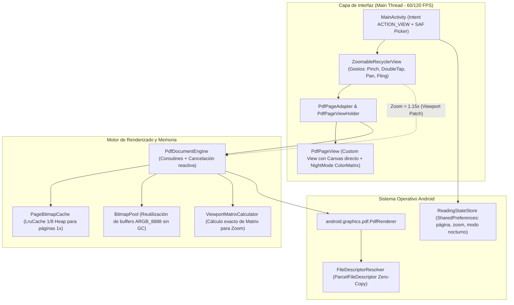

# Plan de Implementación: Visor PDF Ultra-Ligero y de Alto Rendimiento para Android (`UltraLight PdfViewer`)

## 1. Descripción del Objetivo
Diseñar y construir un visor de PDF nativo para Android (**Kotlin + Android Views + API nativa `PdfRenderer`**) enfocado en tres pilares fundamentales:
1. **Peso mínimo del APK (~1 MB en Release)**: Sin motores C++ redundantes (aprovecha el motor `PdfRenderer`/PDFium compartido del sistema operativo Android) y sin frameworks pesados de UI ni bases de datos.
2. **Consumo de RAM estrictamente acotado (< 35 MB en uso típico)**: Reutilización de memoria mediante `BitmapPool` (cero *allocations* durante el scroll) y renderizado de recorte de viewport (*Viewport Tile/Matrix Rendering*) al hacer zoom para evitar crear bitmaps gigantes.
3. **Latencia ultra-baja (60/120 FPS estables)**: Renderizado secuencial libre de bloqueos en hilo dedicado, cancelación inmediata de páginas fuera de pantalla durante *flings* rápidos y apertura instantánea vía descriptor de archivo (`ParcelFileDescriptor`) sin copiar archivos en disco cuando el origen es *seekable*.

---

## 2. Decisiones Clave de Ingeniería

### 2.1. Restricciones y Optimizaciones de `android.graphics.pdf.PdfRenderer`
1. **Serialización de Hilo Único (`Single-Thread Confinement`)**:
   - `PdfRenderer` y `PdfRenderer.Page` **no son thread-safe** y la API nativa de Android exige que solo exista **una única instancia de `PdfRenderer.Page` abierta a la vez** por documento.
   - Todas las operaciones sobre `PdfRenderer` se ejecutan en un `CoroutineDispatcher` dedicado (`Dispatchers.IO.limitedParallelism(1)`) protegido adicionalmente por un `Mutex` de Kotlin Coroutines.
2. **Reutilización In-Situ de Buffers `ARGB_8888`**:
   - `PdfRenderer.Page.render()` exige obligatoriamente `Bitmap.Config.ARGB_8888` (lanza `IllegalArgumentException` si se pasa `RGB_565`).
   - Para evitar que el Garbage Collector (GC) pause la interfaz o cause un `OutOfMemoryError`, implementamos un **`BitmapPool`** combinado con una **`PageBitmapCache` (`LruCache`)**. Cuando una página sale de la caché o del viewport, su `Bitmap` se limpia con `bitmap.eraseColor(Color.WHITE)` y se reutiliza inmediatamente para la siguiente página.
3. **Renderizado de Región Visible en Zoom (`O(1)` en Memoria RAM)**:
   - Al hacer zoom (por ejemplo, `4.0x`), renderizar la página completa requeriría `16x` la memoria normal (~64 MB por una sola página).
   - En su lugar, escalamos instantáneamente el `Bitmap` base (`1x`) en el `Canvas` durante el gesto de pellizco (0 ms de latencia) y, al detenerse el dedo (`80 ms` de *debounce*), renderizamos **únicamente el rectángulo visible en pantalla** usando un `Bitmap` fijo del tamaño del viewport y una matriz de transformación (`Matrix` con `postScale` + `postTranslate`) pasada a `PdfRenderer.Page.render()`.

---

## 3. Arquitectura del Sistema



---

## 4. Estructura del Proyecto

```text
pdfViewer/
├── IMPLEMENTATION_PLAN.md
├── build.gradle.kts
├── settings.gradle.kts
├── gradle.properties
└── app/
    ├── build.gradle.kts
    ├── proguard-rules.pro
    └── src/
        ├── main/
        │   ├── AndroidManifest.xml
        │   ├── java/com/ultralight/pdfviewer/
        │   │   ├── MainActivity.kt
        │   │   ├── engine/
        │   │   │   ├── PdfDocumentEngine.kt
        │   │   │   └── ViewportMatrixCalculator.kt
        │   │   ├── memory/
        │   │   │   ├── BitmapPool.kt
        │   │   │   └── PageBitmapCache.kt
        │   │   ├── storage/
        │   │   │   ├── FileDescriptorResolver.kt
        │   │   │   └── ReadingStateStore.kt
        │   │   └── ui/
        │   │       ├── PdfPageAdapter.kt
        │   │       ├── PdfPageView.kt
        │   │       └── ZoomableRecyclerView.kt
        │   └── res/
        │       ├── drawable/
        │       │   └── ic_launcher_foreground.xml
        │       ├── layout/
        │       │   └── activity_main.xml
        │       └── values/
        │           ├── colors.xml
        │           ├── strings.xml
        │           └── themes.xml
        └── test/
            └── java/com/ultralight/pdfviewer/
                ├── BitmapPoolTest.kt
                └── ViewportMatrixCalculatorTest.kt
```

---

## 5. Presupuesto de Recursos y Rendimiento

| Métrica | Objetivo | Estrategia Implementada |
| :--- | :--- | :--- |
| **Tamaño del APK (Release)** | **< 1.2 MB** | Sin motor nativo duplicado, sin AppCompat/Material pesado, R8 full mode + `isShrinkResources = true`. |
| **Versión de Android** | **`minSdk = 26` / `targetSdk = 35`** | Soporte nativo optimizado desde Android 8.0 hasta Android 15+. |
| **Tiempo de apertura en frío** | **< 120 ms** | Apertura `Zero-Copy` con `ParcelFileDescriptor` + empaquetado de dimensiones en `LongArray` primitivo. |
| **Uso de RAM en lectura 1x** | **15 – 28 MB** | `BitmapPool` acotado + `LruCache` dinámica con reciclaje in-situ. |
| **Uso de RAM en Zoom 5.0x** | **Constante (+ ~8 MB)** | Renderizado de parche del tamaño de la pantalla vía `Matrix`, nunca del tamaño total escalado. |
| **Framerate en Scroll / Zoom** | **60 / 120 FPS fijos** | Cero I/O ni *allocations* en `MainThread`; cancelación instantánea de tareas en `onViewRecycled`. |

---

## 6. Comandos de Compilación y Verificación

1. **Ejecutar pruebas unitarias**:
   ```powershell
   .\gradlew.bat testDebugUnitTest
   ```
2. **Generar APK de Producción (Optimizado con R8)**:
   ```powershell
   .\gradlew.bat assembleRelease
   ```
3. **Instalar APK Debug en dispositivo conectado**:
   ```powershell
   .\gradlew.bat installDebug
   ```
